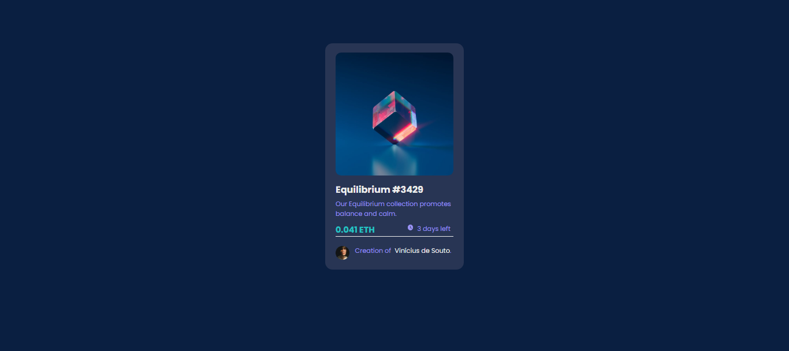

# NFT #Card

## 🚀 | Project

This is a simple project, to train skills in frontend, I'm going back to developing front so I'm training on the initial concepts.

## 💻 | Technologies

I used:

- [React](https://reactjs.org)
- [React icons](https://react-icons.github.io/react-icons/)
- [Sass](https://sass-lang.com/)

## 💻 | Result

  

